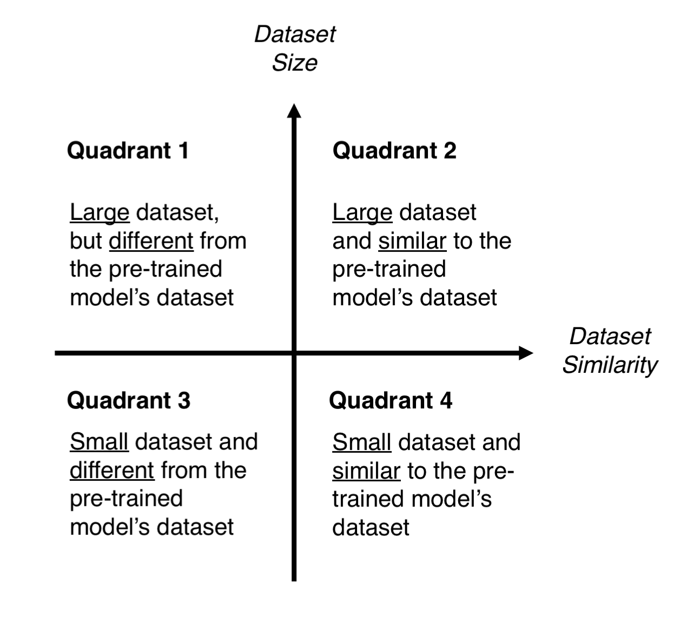
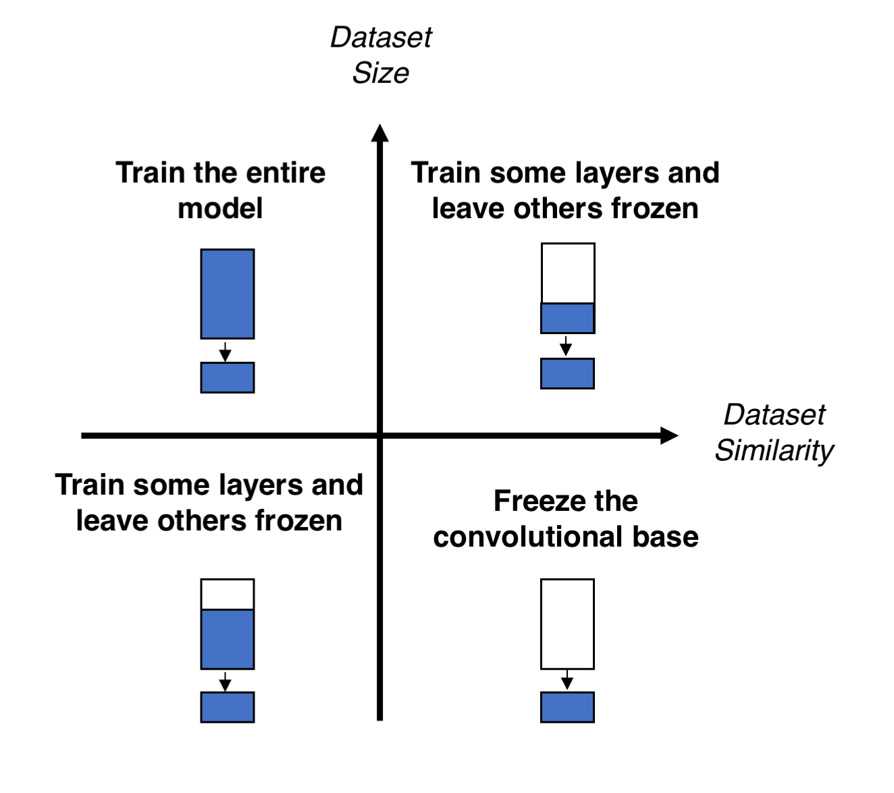
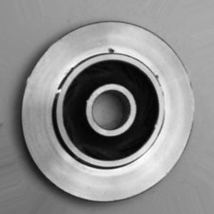
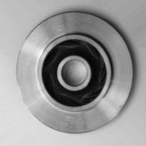

# Machine Learning for Zero Defect Manufacturing Platform

The goal of this project is to show that less is more. 

Eight different models were trained with the same dataset. One of these models was trained from scratch, while the other seven were fine-tuned from publicly available pretrained weights. All of the pretrained weights were trained using the ImageNet dataset and were accessed through the *torchvision* library. Four of the seven pretrained models are CNN (Convolutional Neural Network) architectures, while the remaining three are Transformer architectures.

Before diving into what was done here, here is a brief description of the main approaches to *transfer learning*:
* **Feature extraction**: The classification layer is adjusted to the task at hand. The pretrained weights are *frozen* and only the newly added layer(s) are trained to correctly classify the data.

* **Fine-tuning**: The classification layer is also adjusted to the task at hand. **Some** of the layers are frozen, but the amount is not specified. The unfrozen layers, as well as the newly added layer(s) are trained to classify the data.

Some [sources](https://ijisrt.com/assets/upload/files/IJISRT20NOV654.pdf) explain how the transfer learning works in detail and suggest a "*rule of thumb*" for deciding how to proceede with the transfer learning. They suggest that according to the amount of data for the new task and the similarity between the new dataset and the dataset used for pretraining the model, one can decide how much of the pretrained weights to leave frozen.

In this work we have a small dataset that is very dissimilar to ImageNet. This would lead us to the third quadrant, where we train "*some*" layers, but most of them would be frozen.


  


If a model is designed from scratch, it will take time, various iterations and it will take longer to train

The proposal here is to leave every parameter unfrozen and train with a smaller *learning rate*.

## Dataset
---

The [dataset](https://www.kaggle.com/ravirajsinh45/real-life-industrial-dataset-of-casting-product) used can be accessed [here](https://www.kaggle.com/ravirajsinh45/real-life-industrial-dataset-of-casting-product).

This dataset consists of images containing the top view of pump impellers with and without defects.

|Def|Ok|
:---:|:---:
) | 

## More details
---

The thesis can be accessed through this [link](https://www.overleaf.com/read/bdkddjsdwmwg).

(When it is done, it will be updated to a link containing only the pdf and not the overleaf document.)


## Requirements
---

* torch 1.11.0+cu102
* torchvision 0.12.0+cu102
* pytorch-lighning 1.6.0

### Install requirements through pip


```python
pip install --upgrade torch
pip install --upgrade torchtext     # This needs to be updated for pytorch-lightning to work properly
pip install --upgrade torchvision
pip install pytorch-lightning
```

## Usage
---

Use one of the following codes to load the pretrained weights depending on the model to be used.

### [LUNA](zdmp/utils/luna_model.py)
```python
luna_model = torch.utils.model_zoo.load_url("https://drive.google.com/uc?export=download&id=1-4k-6UBn4kH1ueanXB39Z375FaRmYCYS&confirm=t")
```

### ALEXNET
```python
alexnet_model = torch.utils.model_zoo.load_url("https://drive.google.com/uc?export=download&id=1TjgEAfjbQ9NTzF0Z0S4SiEF9uvmRYO_3&confirm=t")
```

### RESNET18
```python
resnet18_model = torch.utils.model_zoo.load_url("https://drive.google.com/uc?export=download&id=1-Dh-hAa6OIQaU6PMlNXmy9NCAWLrgY7U&confirm=t")
```

### EFFICIENTNETV2
```python
effnetv2_model = torch.utils.model_zoo.load_url("https://drive.google.com/uc?export=download&id=1-EUXk4XO-4kqFlv_MXw0LMDHxTDwgSNg&confirm=t")
```

### CONVNEXT
```python
convnext_model = torch.utils.model_zoo.load_url("https://drive.google.com/uc?export=download&id=1-ExFlJq02ormAJrslXOR2cAuLth3Td2O&confirm=t")
```

### ViT
```python
vit_model = torch.utils.model_zoo.load_url("https://drive.google.com/uc?export=download&id=1CLAj3L9iz8y9saojWLzjPwmjW33MLuSY&confirm=t")
```

### SWIN-T
``` python
swin_t_model = torch.utils.model_zoo.load_url("https://drive.google.com/uc?export=download&id=1-4MKJzlIWcWQeb5D8Ly7aJhfk29fz9-c&confirm=t")
```
## Examples
---

The following notebooks show how the models where trained and how to use them with the casting dataset. 

* [Training the models](notebooks/train_models_example.ipynb)
* [Loading the models](notebooks/load_models_example.ipynb)

## Author
---

Matias Vasquez (e11742193@student.tuwien.ac.at)

## References

